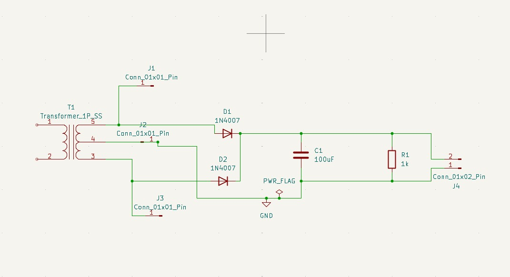
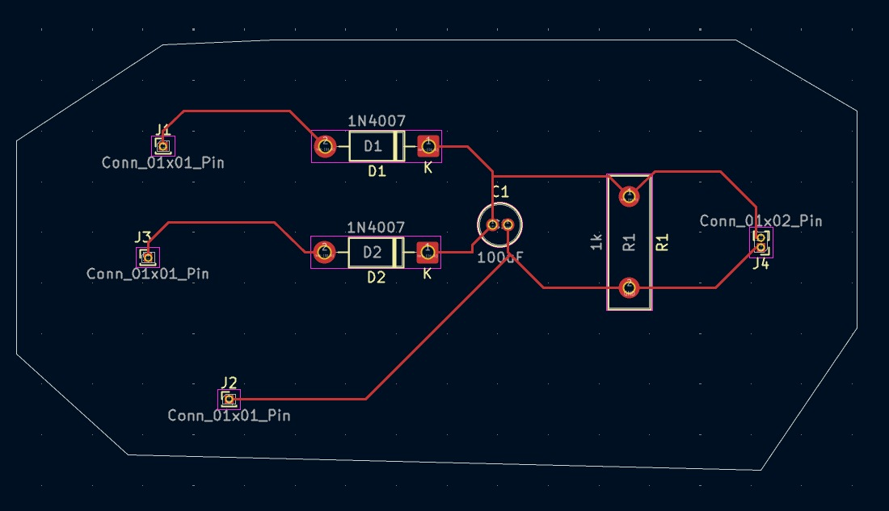
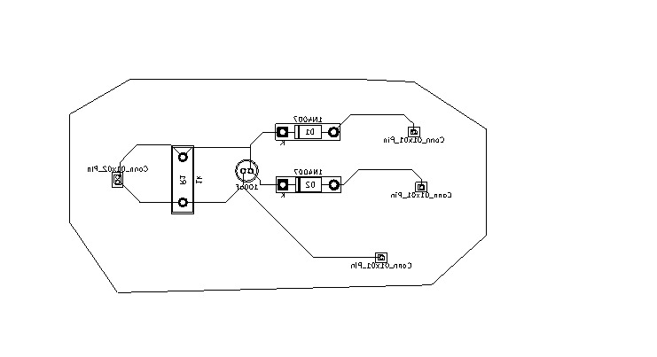

# Fullwave-rectifier-PCB-design-using-kicad
Full Wave Rectifier PCB Design using KiCad

Overview :

This project demonstrates the design and implementation of a Full Wave Rectifier circuit.
The circuit schematic and PCB layout were designed using KiCad, and the hardware was tested using a breadboard prototype.
The full-wave rectifier converts AC voltage into DC voltage using diodes and a filter capacitor.

Tools Used :

- KiCad (PCB Design)
- Breadboard Prototype
- Oscilloscope for output measurement
- required components 

Circuit Diagram :

Schematic :

PCB Layout :

"PCB Layout" (Hardware/pcb_layout.png)

3D PCB View :

Hardware Implementation :

"Hardware Setup" (Hardware/hardware_setup.jpg)

Output Waveform :

"Oscilloscope Output" (Hardware/oscilloscope_output.jpg)

Components Used :
- Transformer
- Two 1N4007 Diodes
- 100 µF Capacitor
- 1 kΩ Resistor
- Breadboard and connecting wires

Working Principle :
A center-tapped transformer provides the AC input to the rectifier circuit.
- During the positive half cycle, one diode conducts and supplies current to the load.
- During the negative half cycle, the other diode conducts.
Thus, both halves of the AC signal are used to produce a full-wave rectified output.
The capacitor acts as a filter, reducing ripple and producing smoother DC voltage.

Applications :
- DC power supplies
- Battery charging circuits
- Electronic devices requiring DC voltage
